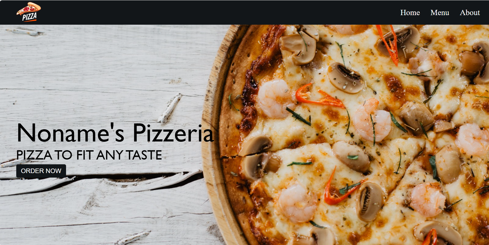

# Noname's Pizzeria

This is a simple React project for a pizza restaurant website. It displays a homepage with a banner, a menu section featuring different pizzas, and an about section with details about the restaurant.

## Features

- **Responsive Design**: The layout adjusts dynamically for different screen sizes.
- **Menu Section**: A grid display of pizza items with names and prices.
- **About Section**: Information about the restaurant.

## Technologies Used

- React: For building the user interface.
- CSS: For styling the components.

## Project Structure

```
src/
|-- components/
|   |-- Navbar.js
|   |-- Home.js
|   |-- Menu.js
|   |-- About.js
|-- App.js
|-- index.js
|-- styles/
    |-- App.css
    |-- Navbar.css
    |-- Menu.css
    |-- About.css
```

### Components

1. **Navbar**: Contains links to navigate to different sections (Home, Menu, About).
2. **Home**: Displays the banner image and title.
3. **Menu**: Shows a grid of pizza items with images, names, and prices.
4. **About**: Contains an image and description of the restaurant.

## Setup Instructions

1. Clone the repository:
   ```bash
   git clone https://github.com/your-username/nonames-pizzeria.git
   ```

2. Navigate to the project directory:
   ```bash
   cd nonames-pizzeria
   ```

3. Install dependencies:
   ```bash
   npm install
   ```

4. Start the development server:
   ```bash
   npm start
   ```

5. Open your browser and go to:
   ```
   http://localhost:3000
   ```

## Deployment

To build the project for production, run:
```bash
npm run build
```

This will create an optimized build in the `build/` folder, which you can deploy to a hosting platform of your choice.

## Screenshots

### Homepage


### Menu Section


### About Section


## Future Improvements

- Add a shopping cart functionality.
- Integrate a backend for dynamic content.
- Add animations for better user experience.

---

Feel free to contribute to this project or customize it for your needs!
